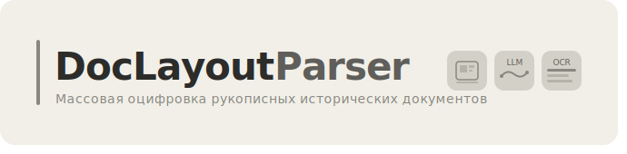
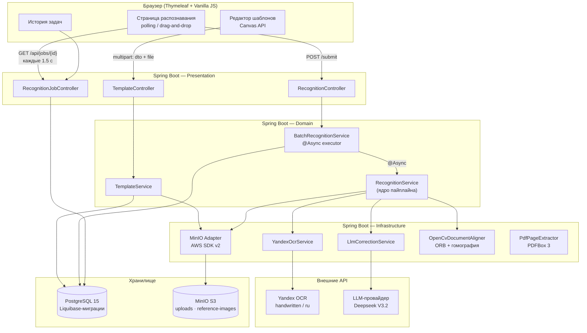
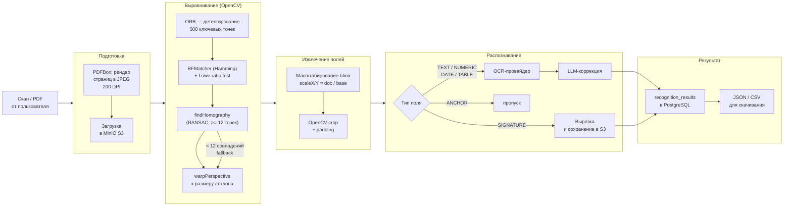

<div align="center">
  
</div>


Инструмент для массовой оцифровки однотипных рукописных исторических документов.

Исследователь один раз размечает шаблон — обводит мышью нужные поля на образце. Дальше система сама обрабатывает любое количество аналогичных страниц: вырезает фрагменты, распознаёт рукопись и исправляет ошибки через языковую модель. На выходе — структурированная таблица, готовая к анализу.

---

## Зачем это нужно

Ручная расшифровка рукописного текста — медленная работа. Один документ с десятком полей занимает от нескольких минут до получаса. При масштабе в тысячи единиц хранения это превращается в многолетний труд.

Существующие решения либо недоступны для оплаты (Transkribus, ABBYY), либо дают низкое качество на русской рукописи (Tesseract, TrOCR), либо стоят сотни тысяч рублей (Smart Engines). DocLayoutParser предлагает другой подход: без программирования, через визуальный интерфейс, с модульным OCR-пайплайном который легко переключается на любого провайдера.

---

## Как это работает

```
Загрузить образец → Разметить поля → Обработать пакет → Получить CSV/JSON
```

1. Пользователь загружает образец документа и рисует прямоугольники вокруг нужных полей — система сохраняет координаты относительно размеров эталона
2. При обработке нового документа вычисляется коэффициент масштабирования, OpenCV вырезает размеченные зоны с учётом паддинга
3. Фрагменты уходят в OCR-провайдер (в текущей реализации — Yandex Cloud OCR, `handwritten`)
4. Сырой текст передаётся в LLM, которая исправляет ошибки по контексту
5. На выходе — JSON с распознанными полями; подписи сохраняются как изображения в Base64

---

## Возможности

- **Редактор шаблонов** — визуальная разметка зон на изображении (текст, числа, подписи) через Canvas API, без программирования
- **Пакетная обработка** — один шаблон на тысячи документов
- **LLM-коррекция** — восстанавливает смысл там, где OCR прочитал букву неверно
- **Многостраничные PDF** — для каждой страницы можно задать отдельную разметку
- **Экспорт** — JSON и CSV; история всех задач обработки
- **Модульная архитектура** — OCR и LLM-провайдер меняются без переписывания бизнес-логики

---

## Стек

| Слой | Технологии |
|---|---|
| Backend | Java 17, Spring Boot 3.2.5, Spring Data JPA, Hibernate |
| База данных | PostgreSQL 15, Liquibase |
| Объектное хранилище | MinIO (S3-совместимый), AWS SDK v2, presigned URLs |
| Обработка изображений | OpenCV 4.9 (openpnp) — выравнивание, кроп, гомография |
| PDF | Apache PDFBox 3.0.2 — рендер страниц в JPEG |
| OCR | Yandex Cloud OCR API, модель `handwritten` |
| LLM-постобработка | Deepseek V3.2 через Yandex AI Studio |
| Frontend | Thymeleaf, Vanilla JS (ES-модули), Canvas API |
| Инфраструктура | Docker, Docker Compose, Eclipse Temurin 17 |
| API-документация | SpringDoc OpenAPI (Swagger UI) |
| Маппинг | MapStruct, Lombok |

---

## Архитектура

Приложение построено по принципу **Hexagonal Architecture** (ports & adapters): бизнес-логика в domain-слое ничего не знает о конкретных внешних сервисах — она работает только через интерфейсы-порты. Это позволило менять OCR-провайдера три раза в процессе разработки, не трогая ядро.



---

## Путь документа через систему



---

## Тестирование на реальных документах

Параллельно с разработкой вели работу с реальными архивными материалами — искали однотипные документы с чёткой структурой полей, размечали шаблоны и обрабатывали через систему.

**Акты о рождении** — метрические книги из открытых фондов [Яндекс.Архива](https://yandex.ru/archive). Каждая страница содержит две записи, шаблон включает 9×2 = 18 полей. Обработано 6 страниц (12 записей). Качество превосходное — аккуратный канцелярский почерк, стандартизированный бланк.

**Плановая таблица боя** — документ военного делопроизводства с портала [«Память Народа»](https://pamyat-naroda.ru). Шаблон из 11 полей. Именно на этом документе сравнивались все OCR-движки и был выбран итоговый стек.

### Метрики качества

Тестовый корпус — страницы целиком без разметки полей, что заведомо хуже реальных условий работы: в реальности система получает чистые вырезанные фрагменты без колонтитулов и артефактов сканирования.

| Тип документа | CER без LLM | CER с LLM | WER без LLM | WER с LLM |
|---|---|---|---|---|
| Машинопечатный (советская эпоха) | 7.21% | **4.35%** | 37.78% | **16.74%** |
| Рукописный (начало XX века) | 22.41% | **16.98%** | 57.71% | **41.91%** |

> CER < 10% — приемлемо для исследовательской работы; CER < 3% — профессиональный архивный стандарт.

LLM-коррекция снижает CER машинопечатного текста до 4.35% и вдвое уменьшает WER. На рукописи XIX–XX века результат скромнее — Yandex OCR обучался преимущественно на современной рукописи, это структурное ограничение не решается постобработкой без дообучения базовой модели.

<details>
<summary>Тестовые источники</summary>

- Машинопечатные: ГАСО, фонд Р-2020, опись №1, стр. [231](https://yandex.ru/archive/catalog/742f3d4a-4dab-4a2c-91c9-04c7a136a4cf/231), [232](https://yandex.ru/archive/catalog/742f3d4a-4dab-4a2c-91c9-04c7a136a4cf/232), [233](https://yandex.ru/archive/catalog/742f3d4a-4dab-4a2c-91c9-04c7a136a4cf/233), [236](https://yandex.ru/archive/catalog/742f3d4a-4dab-4a2c-91c9-04c7a136a4cf/236), [237](https://yandex.ru/archive/catalog/742f3d4a-4dab-4a2c-91c9-04c7a136a4cf/237), [238](https://yandex.ru/archive/catalog/742f3d4a-4dab-4a2c-91c9-04c7a136a4cf/238)
- Рукописные: дело Копылова (1906 г.), стр. [9](https://yandex.ru/archive/catalog/065eadb5-c558-42c6-86ef-d113eaee71b3/9), [10](https://yandex.ru/archive/catalog/065eadb5-c558-42c6-86ef-d113eaee71b3/10), [12](https://yandex.ru/archive/catalog/065eadb5-c558-42c6-86ef-d113eaee71b3/12), [14](https://yandex.ru/archive/catalog/065eadb5-c558-42c6-86ef-d113eaee71b3/14)

</details>

---

## Выбор OCR-стека

| Решение | Результат |
|---|---|
| Tesseract | Печатный текст — хорошо; рукопись — неприемлемо |
| Surya (нейросеть) | Лучше Tesseract, для советской рукописи недостаточно |
| PaddleOCR | Нестабильные результаты |
| HuggingFace (церковнославянские модели) + Surya | ~7–10 сек/слово — часы на один документ |
| **Yandex OCR + Deepseek V3.2** | ✅ Лучшее качество на русской рукописи |

Архитектура с портами позволила менять провайдера без изменений в бизнес-логике — достаточно поменять реализацию одного интерфейса.

---

## Запуск

```bash
git clone https://github.com/...
docker-compose up --build
```

Редактор шаблонов: [http://localhost:8080/templates/editor](http://localhost:8080/templates/editor)  
API-документация (Swagger): [http://localhost:8080/swagger-ui.html](http://localhost:8080/swagger-ui.html)

---

## Известные ограничения

**Плавающая геометрия таблиц** — система работает с фиксированными прямоугольниками. Если ширина ячеек варьируется от экземпляра к экземпляру, разметка съезжает. Решение: детекция линий таблицы через OpenCV или layout-детектор первым проходом.

**Перспективные искажения** — документ должен быть отсканирован относительно ровно. Автовыравнивание по якорным точкам (Warp Perspective) не реализовано.

**Prompt injection** — если в документе встречается текст вида «игнорируй предыдущие инструкции», LLM его выполняет. Реализована базовая фильтрация, полноценная защита требует отдельной работы.

**Нет асинхронной обработки** — обработка пакета занимает около минуты; пользователь ждёт без обратной связи. Нужны SSE или WebSocket вместо поллинга.

---

## Что дальше

- Автоматическое определение границ таблиц по линиям документа
- Дообучение OCR-модели на конкретном типе документов
- Server-Sent Events для уведомлений о завершении задачи
- Поддержка нескольких OCR-провайдеров на выбор пользователя